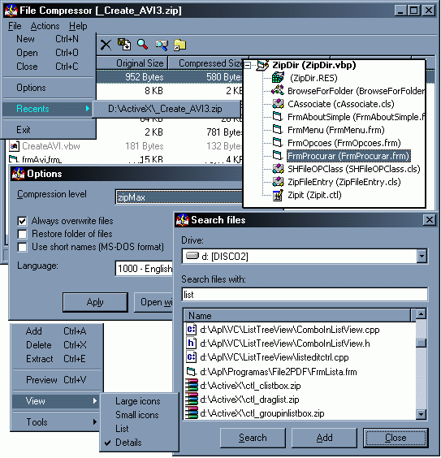



## ZipDir \- Complete Compression Tool \(like Winzip\)

### Description

This its a full application developed with Microsoft Visual Basic to manage (create and update) compressed files with Zip Compression method.

In this project i use the Richsoft Zipit 1.0 control (is very useful to work in Visual Basic). Uncompress dll's of attached zip file in your windows\system folder.

This applicatio include:

- Make new zip files

- Open zip files

- Close zip file

- Support to options

-> Compression Level

-> Always overwrite

-> Restore folders

-> User Short-names

-> Support to multilanguage (english/portuguese)

-> Associantion of zip files with this app

- List of recent files

- Add new files to zip file

- Delete files from zip file

- Extract files from zip file

- Preview files (temp folder) from zip file

- Multiple views from main list (icon,list,etc...)

- Find files in drive to add in zip file

- Add folders to zip file
 
### More Info
 
Remember: is necessary have the dll files in your windows\system folder

             |
---                |---
**Submitted On**   |2003-02-15 13:49:58
**By**             |[Mauricio Cunha](https://github.com/Planet-Source-Code/PSCIndex/blob/master/ByAuthor/mauricio-cunha.md)
**Level**          |Intermediate
**User Rating**    |4.4 (31 globes from 7 users)
**Compatibility**  |VB 5\.0, VB 6\.0
**Category**       |[Complete Applications](https://github.com/Planet-Source-Code/PSCIndex/blob/master/ByCategory/complete-applications__1-27.md)
**World**          |[Visual Basic](https://github.com/Planet-Source-Code/PSCIndex/blob/master/ByWorld/visual-basic.md)
**Archive File**   |[ZipDir\_\-\_C1544802152003\.zip](https://github.com/Planet-Source-Code/mauricio-cunha-zipdir-complete-compression-tool-like-winzip__1-43229/archive/master.zip)

